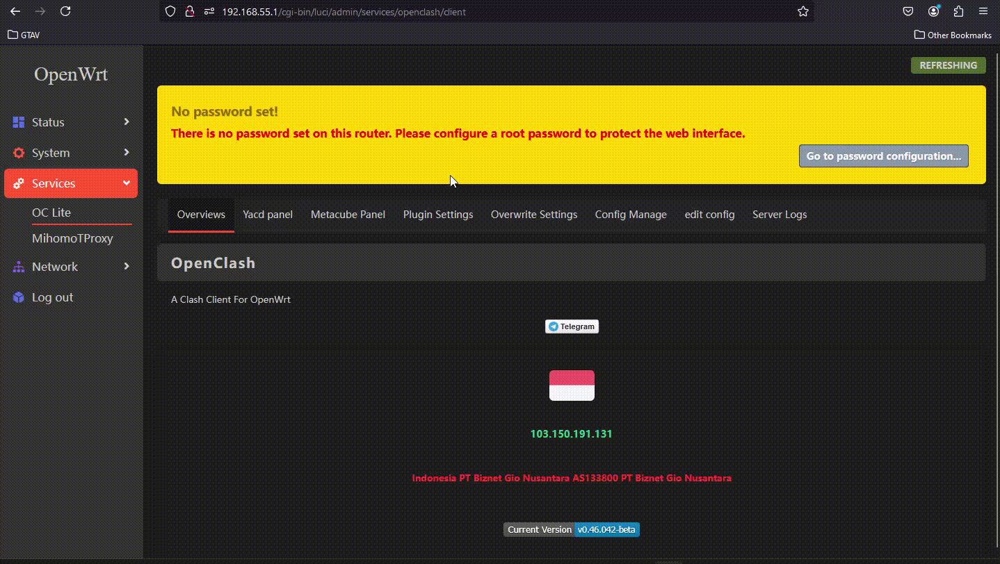

## OpenClash lite version


[](https://github.com/bobbyunknown/OpenClash-lite/releases)
[](https://github.com/bobbyunknown/OpenClash-lite)


#### Telegram group:
[](https://t.me/+TuLCASzJrVJmNzM1)


Original repo from [@vernesong/OpenClash](https://github.com/vernesong/OpenClash)

### Added Features
- IP display
- Yacd panel
- Metacube panel
- Config editor panel

### Installation
- For manual installation, please download from the releases
- Auto install
```
bash -c "$(curl -fsSL https://raw.githubusercontent.com/bobbyunknown/OpenClash-lite/refs/heads/main/install.sh)"
```


### Additional
For the config editor to function properly, please install tinyfm
```
bash -c "$(curl -fsSL https://raw.githubusercontent.com/bobbyunknown/luci-app-tinyfm/refs/heads/main/install.sh)"
```
> **Note:** 
> To use the config editor:
> 1. Open File Manager
> 2. Navigate to Config > Symlink > Openclash 
> 3. Create a symlink


This is a lightweight version of OpenClash, a Clash client for OpenWrt. Some key features:


- Compatible with Shadowsocks, ShadowsocksR, Vmess, Trojan, and other protocols.
- Uses flexible configuration rules for strategic proxying


For more information, please visit the original repo.


Screenshots

### Screenshots




